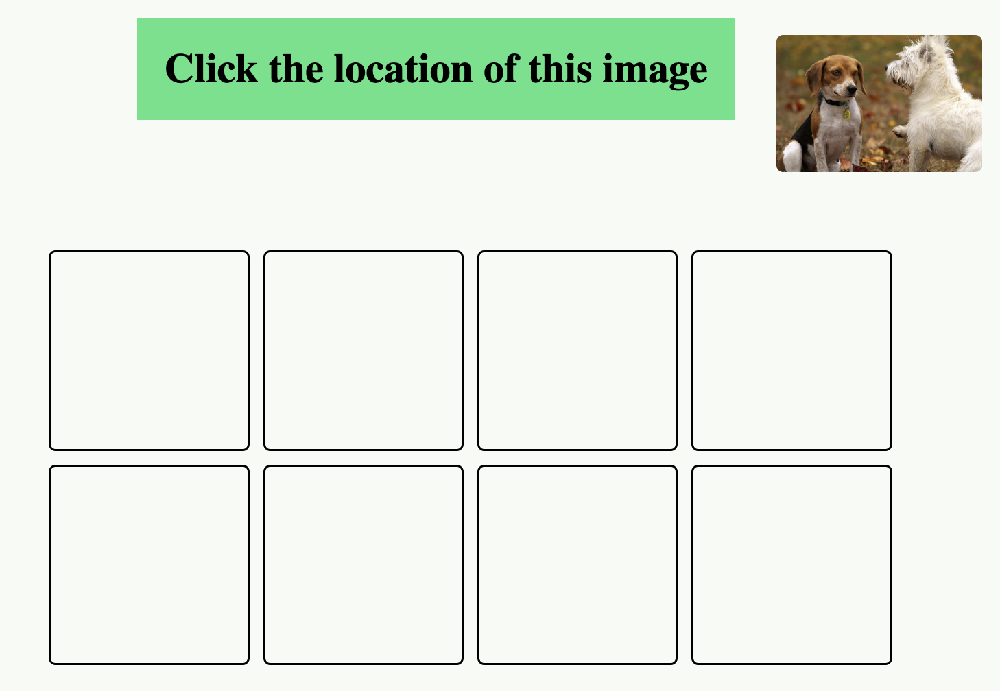

# Memorize the position of the images
  
 

## Game Instruction
* This game is designed to test and improve your memory and attention skills. 

* Eight images will appear on the screen at the start of each round. These images will be visible for 8 seconds before disappearing After the images disappear, a single image will appear in the upper right corner of the screen. You must click the correct location where this image was initially displayed.Each correct choice earns you one point. Incorrect choices will result in zero points.

## Game Time
* [Play Game](https://nani1345.github.io/memory-game/)

## External Resources
* [Game Planning](https://docs.google.com/document/d/1ym-tGrkNwR1ULqoGW6tnGrUE67ou9hIsKc-pkZBpN_w/edit)
* [Github Repo](https://github.com/Nani1345/memory-game)  

## Future Enhancements
* Adding animation content.
* Adding more game options according the difficulty of the game.
* Add a time limit when the player chooses.

